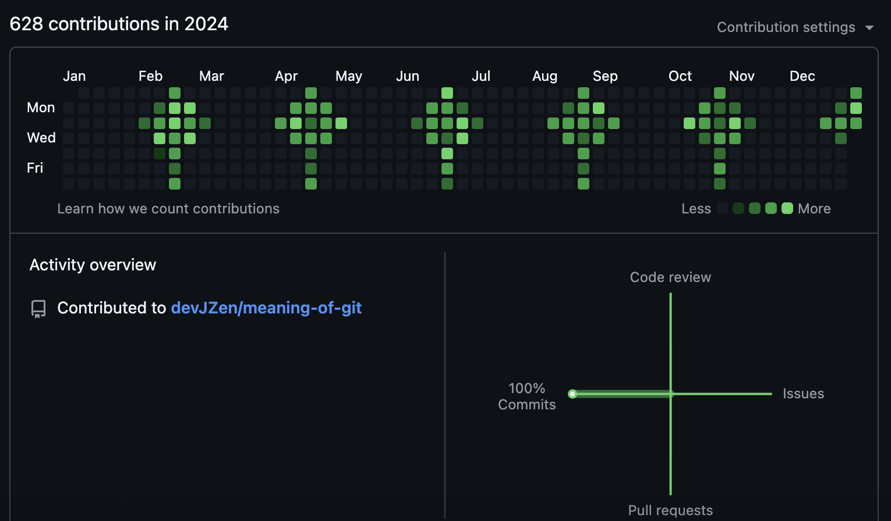
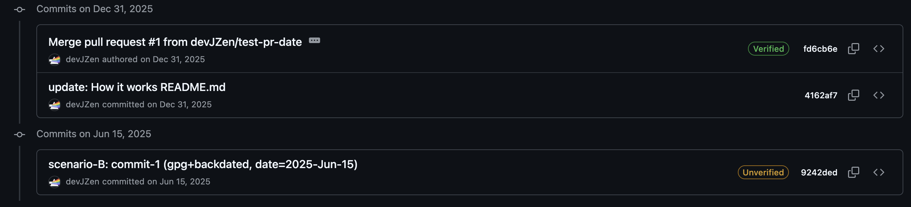
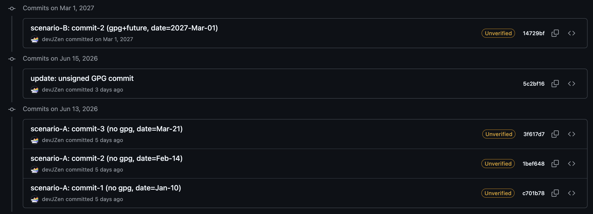

# git-log-hack

**한국어** | **[English](README_EN.md)**

Claude와 함께 작성하였습니다.

수정일: 2026년 6월 18일

---

## 돌아보며

이 프로젝트를 마무리하면서 한 가지 생각이 남았습니다.

Git이 커밋 날짜를 클라이언트에 맡기고 서버가 검증하지 않는 것은 설계상의 트레이드오프입니다. 리누스 토르발즈가 Git을 만들 때 최우선으로 생각한 것은 날짜의 정확성이 아니라 **많은 개발자가 함께 협력할 수 있는 분산 시스템**이었습니다. 그 철학 덕분에 날짜 조작이 기술적으로 가능한 것이기도 합니다.

연구를 진행하면서 이 '틈'을 탐색하는 과정 자체는 흥미로웠지만, 결국 Git의 히스토리는 내가 실제로 무엇을 했는지를 기록하는 도구라는 생각에 이르렀습니다. 함께 일하는 사람들과 이력을 공유할 때 그 이력이 의미 있으려면, 날짜보다는 커밋 하나하나가 실제 작업을 담고 있어야 한다는 것을 느꼈습니다.

그래서 연구 목적으로 만들었던 600여 개의 Flower commit을 정리하고, 연구 내용을 담은 커밋만 남겼습니다. 형상 관리는 결국 협업을 위한 도구입니다.

## 개요



GitHub 잔디밭(contribution graph)은 **Author Date**를 기준으로 그려지므로 과거와 미래의 기여도를 모두 통제할 수 있습니다.

이 프로젝트는 Git 커밋 날짜를 조작하여 GitHub 잔디밭에 원하는 패턴을 그리는 방법을 보여줍니다.

조작도 아닐뿐더러 분산형 시스템이기에 많은 사용자가 함께 작업하는 것에 의의를 뒀던 리누스 토르발즈의 철학이 담긴게 Git 이었습니다.

형상 관리는 형상 관리지만 분산형 시스템 모델을 공부하기에 좋았던 프로젝트예요.

[Linux man](https://linux.die.net/man) 이라는 멋진 사이트도 알게됐어요.

트레이드 오프가 있음에도 Git 커밋 날짜를 수정할 수 있게 했던 것은 해시 변조로 확인할 수 있었습니다.

메시지나 패킷을 송신할 때 해시를 확인하는 것과 같은 이유죠.

GitHub에서 실제로 확인한 커밋 이력입니다. 과거·미래 날짜가 그대로 기록됩니다.





## 빠른 사용법

```bash
# 1. 패턴 디자인 (대화형 에디터)
cd interactive-cli
python3 github_canvas.py
# → 방향키로 이동, Space로 칠하기, S로 저장, Q로 종료

# 2. Git 커밋 생성
python3 git_generator.py generate pattern.json 2024

# 3. GitHub에 푸시
cd ..
git push -f origin main
```

> **중요**: `github_canvas.py`는 패턴 디자인만, `git_generator.py`는 실제 커밋 생성을 담당합니다.

## 작동 원리

GitHub 잔디밭은 다음 메커니즘으로 생성됩니다:

1. **로컬에서 커밋 생성**: 클라이언트에서 `GIT_AUTHOR_DATE`와 `GIT_COMMITTER_DATE`를 사용하여 날짜를 자유롭게 설정할 수 있습니다
2. **서버에 저장**: GitHub(및 다른 Git 플랫폼)은 받은 커밋의 날짜를 검증 없이 저장합니다
3. **검증 없음**: 서버는 타임스탬프의 진위를 검증하지 않습니다

**모든 Git 플랫폼에 적용됩니다**: GitHub, GitLab, Bitbucket, Gitea 등

### 기술적 세부사항

```bash
# 커스텀 날짜로 커밋 생성
GIT_AUTHOR_DATE="2024-01-15 10:00:00" \
GIT_COMMITTER_DATE="2024-01-15 10:00:00" \
git commit -m "과거 날짜 커밋"
```

잔디밭은 커밋 생성 시각이나 푸시 시각이 아닌 **Author Date**를 기준으로 표시됩니다.

## 기능

### 1. 기본 스크립트

`create_flower_commits.py`로 간단한 패턴 생성

```bash
python3 create_flower_commits.py
```

### 2. 대화형 캔버스 에디터

터미널 기반 대화형 에디터로 커스텀 패턴 그리기

```bash
cd interactive-cli
python3 github_canvas.py
```

**기능**:

- 실시간 패턴 미리보기
- 5단계 강도 조절 (일일 커밋 0-4개)
- 2가지 표시 스타일 (음영/블록)
- 패턴 저장/불러오기 (JSON 형식)
- Git 커밋 자동 생성

**키 조작법**:

- 방향키: 커서 이동
- Space: 강도 토글 (0→1→2→3→4→0)
- 0-4: 직접 강도 설정
- T: 표시 스타일 변경
- S: 패턴 저장
- L: 패턴 불러오기
- C: 캔버스 초기화
- Q/ESC: 종료

자세한 사용법은 [interactive-cli/README.md](interactive-cli/README.md)를 참고하세요.

## 예제

최종 정리 후 `git log` (654개 → 20개):

```
5f1a218  2026-06-18  update: find meaning of git
e65d8fb  2026-06-15  update: unsigned GPG commit
962dbe0  2024-11-05  scenario-B: commit-3 (gpg+past, date=2024-Nov-05)
374fc25  2027-03-01  scenario-B: commit-2 (gpg+future, date=2027-Mar-01)
dc2c2f0  2025-06-15  scenario-B: commit-1 (gpg+backdated, date=2025-Jun-15)
2be6e98  2026-03-21  scenario-A: commit-3 (no gpg, date=Mar-21)
e2f3c53  2026-02-14  scenario-A: commit-2 (no gpg, date=Feb-14)
20e7ed7  2026-01-10  scenario-A: commit-1 (no gpg, date=Jan-10)
2d96dbb  2026-06-15  update: README.md
6c9531d  2026-01-05  feat: async project - git_generator - github_canvas - README
f0ecd3e  2026-01-05  docs: explain to project
4d124d1  2026-01-05  docs: explain to project
c0beb68  2026-01-02  test: Wiki Date Manipulation
f4ecc3f  2025-12-31  Merge pull request #1 from devJZen/test-pr-date
a1d4ee7  2025-12-31  update: How it works README.md
bb0ff4c  2025-12-31  first commit
```

## 이력 정리 과정

### 1단계 — Flower commit 제거

`flower_commits.txt`만 건드리는 커밋 600여 개를 `git filter-repo`로 일괄 제거했습니다.
파일을 이력에서 삭제하면 해당 파일만 수정하던 커밋들이 빈 커밋이 되어 자동으로 정리됩니다.

```bash
git filter-repo --force \
  --invert-paths --path flower_commits.txt \
  --prune-empty always
```

### 2단계 — 브랜치·stash 정리

`git filter-repo`는 `main`을 재작성했지만, 다른 브랜치의 remote tracking ref가
정리 전의 옛 히스토리(Flower commit 포함)를 여전히 참조하고 있었습니다.
브랜치마다 심어진 커밋도 GitHub 기여 그래프에 반영되기 때문에 함께 제거해야 합니다.

| 삭제 항목 | 이유 |
|-----------|------|
| `research/gpg-immutability` 로컬·원격 브랜치 | 연구 완료, main에 반영됨 |
| `test-pr-date` 로컬·원격 브랜치 | PR 실험 완료, 불필요 |
| stash | 재작성 전 커밋을 참조하는 오래된 항목 |

```bash
# stash 삭제
git stash drop

# 로컬 브랜치 삭제
git branch -D research/gpg-immutability test-pr-date

# remote tracking ref 삭제 (로컬)
git branch -r -d origin/research/gpg-immutability origin/test-pr-date

# 참조 없는 객체 정리
git gc --prune=now --aggressive

# GitHub 원격 브랜치 삭제
git push origin --delete research/gpg-immutability test-pr-date
```

### 3단계 — reflog 만료 후 완전 정리 (누락 시 기여 그래프 잔존)

`git gc`는 reflog에 남아있는 항목이 있으면 해당 객체를 "아직 참조됨"으로 보고 삭제하지 않습니다.
`git filter-repo`나 브랜치 삭제 후에도 reflog를 먼저 비우지 않으면 옛 커밋 객체가 남아
GitHub 기여 그래프에 계속 표시될 수 있습니다.

```bash
# reflog 항목 전부 즉시 만료 → gc가 완전히 수거할 수 있게 됨
git reflog expire --expire=now --all

# 참조 없는 객체 완전 제거
git gc --prune=now --aggressive

# GitHub에 현재 상태가 최종본임을 알림
git push -f origin main
```

### GitHub 기여 그래프 reindex

force push 이후에도 기여 그래프가 즉시 갱신되지 않을 수 있습니다.

GitHub는 기여 그래프를 **저장소의 현재 상태**가 아닌 **서버가 수신한 push 이벤트 로그**를 기반으로 집계합니다.
이 이벤트 스토어는 force push로 덮어쓸 수 없으며, **UTC 기준 자정 배치**로 재계산됩니다.

| 상황 | 결과 |
|------|------|
| 로컬 `git gc`만 실행 | GitHub에 영향 없음 |
| `git push -f` | GitHub가 새 ref 수신, 다음 배치에서 재계산 |
| UTC 자정 경과 | 기여 그래프 갱신 반영 |

> **비대칭성**: 백데이트 커밋 추가는 즉시 반영되지만, 제거는 배치 처리를 기다려야 합니다.

## 프로젝트 구조

```
git-log-hack/
├── create_flower_commits.py    # 간단한 꽃 패턴 스크립트
├── interactive-cli/             # 대화형 캔버스 에디터
│   ├── github_canvas.py        # 터미널 기반 패턴 에디터
│   ├── git_generator.py        # 패턴 → Git 커밋 변환기
│   ├── patterns/               # 저장된 패턴 파일
│   └── README.md               # 상세 사용 가이드
├── README.md                   # 이 파일 (한국어)
└── README_EN.md                # 영어 버전
```

## 강도 레벨

- **0**: 비어있음 (커밋 없음)
- **1**: 연한 초록 (1-3개 커밋)
- **2**: 중간 초록 (4-7개 커밋)
- **3**: 진한 초록 (8-12개 커밋)
- **4**: 매우 진한 초록 (13-20개 커밋)

## 연구 & 실험

이 프로젝트는 Git 날짜 조작에 대한 광범위한 연구를 포함합니다:

### 성공한 실험 ✅

- **커밋 날짜 조작**: 완벽하게 작동
- **과거 날짜 PR**: 머지 시 커밋 날짜 유지됨
- **Wiki 날짜 조작**: 작동하지만 잔디밭에는 반영 안됨

### 한계 ❌

- **PR 생성 날짜**: 소급 적용 불가능 (서버에서 생성)
- **PR 머지 날짜**: 소급 적용 불가능
- **Issue 생성 날짜**: 소급 적용 불가능 (API 제한)
- **Star 날짜**: 조작 불가능하며 시도 시 약관 위반

연구 문서:

- `pr-creation-date-research.md` - PR 생성 날짜 조작 연구
- `test-pr-experiment.md` - PR 날짜 조작 실험 결과
- `wiki-experiment.md` - Wiki 날짜 조작 실험 결과

## 주의사항

### ⚠️ 경고

1. **`git push -f`는 히스토리를 덮어씁니다**: 중요한 저장소에는 사용하지 마세요
2. **이메일 설정**: git 이메일이 GitHub 계정과 일치해야 합니다
   ```bash
   git config user.email "your-github@email.com"
   ```
3. **프라이빗 리포지토리**: "Private contributions" 설정 활성화 필요할 수 있음
4. **패턴 크기**: 7줄 (요일) × 52칸 (주)

### 윤리적 고려사항

이 프로젝트는 다음을 위한 것입니다:

- ✅ 교육 목적
- ✅ Git 내부 구조 이해
- ✅ 자신의 프로필에 재미있는 패턴 만들기
- ✅ 분산 시스템의 신뢰 모델 시연

이 프로젝트는 다음을 위한 것이 아닙니다:

- ❌ 취업을 위한 허위 경력 조작
- ❌ 기여도 통계 오도
- ❌ GitHub 서비스 약관 위반

## GitHub 잔디밭 작동 방식

**기여도로 인정되는 것**:

- ✅ 커밋 (Author Date 기준)
- ✅ Pull Request 생성
- ✅ Issue 생성
- ✅ 코드 리뷰

**인정되지 않는 것**:

- ❌ PR 머지 날짜
- ❌ 머지 커밋 (일반 커밋으로 표시됨)
- ❌ Wiki 커밋 (날짜 조작은 가능하지만 잔디밭에 반영 안됨)
- ❌ 포크 커밋 (포크 소유자가 아닌 경우)

**사용되는 날짜**: Author Date (`GIT_AUTHOR_DATE`), Committer Date나 푸시 시각 아님

## 자주 묻는 질문 (FAQ)

**Q: 계정이 정지될 수 있나요?**
A: 커밋 날짜 조작 자체는 GitHub 약관 위반이 아닙니다. 다만 책임감 있게 사용하세요.

**Q: PR이 왜 커밋으로 표시되나요?**
A: GitHub 잔디밭은 커밋을 추적하지 PR 머지 이벤트를 추적하지 않습니다. PR 내의 커밋들이 Author Date 기준으로 개별적으로 계산됩니다.

**Q: PR 생성 날짜를 과거로 할 수 있나요?**
A: 아니요, PR 생성 타임스탬프는 서버에서 생성되며 수정할 수 없습니다.

**Q: 프라이빗 리포지토리에서도 작동하나요?**
A: 네, 하지만 GitHub 설정에서 "Private contributions"를 활성화해야 할 수 있습니다.

**Q: 다른 Git 플랫폼에서도 사용할 수 있나요?**
A: 네! GitLab, Bitbucket 등 다른 플랫폼도 커밋 날짜 기반의 유사한 활동 그래프를 사용합니다.

## 고급 사용법

### 여러 연도에 걸친 커밋 생성

```bash
python3 git_generator.py generate pattern.json 2023
python3 git_generator.py generate pattern.json 2024
```

### 생성 전 패턴 미리보기

```bash
python3 git_generator.py preview pattern.json
```

### 커스텀 패턴 파일

패턴은 JSON 형식으로 저장됩니다:

```json
{
  "grid": [
    [0, 0, 1, 0, 0, ...],
    [0, 1, 2, 1, 0, ...],
    ...
  ],
  "width": 52,
  "height": 7,
  "created": "2024-12-31T09:00:00"
}
```

## 연구 문서

- `git-date-commands-research.md` - Git 날짜 조작 종합 가이드
- `PR-vs-COMMIT-FAQ.md` - PR이 커밋으로 표시되는 이유

## 라이선스

이 프로젝트는 교육 목적입니다. 책임감 있고 윤리적으로 사용하세요.

## 작성자

[@devJZen](https://github.com/devJZen)

---

**최종 업데이트**: 2026-06-18